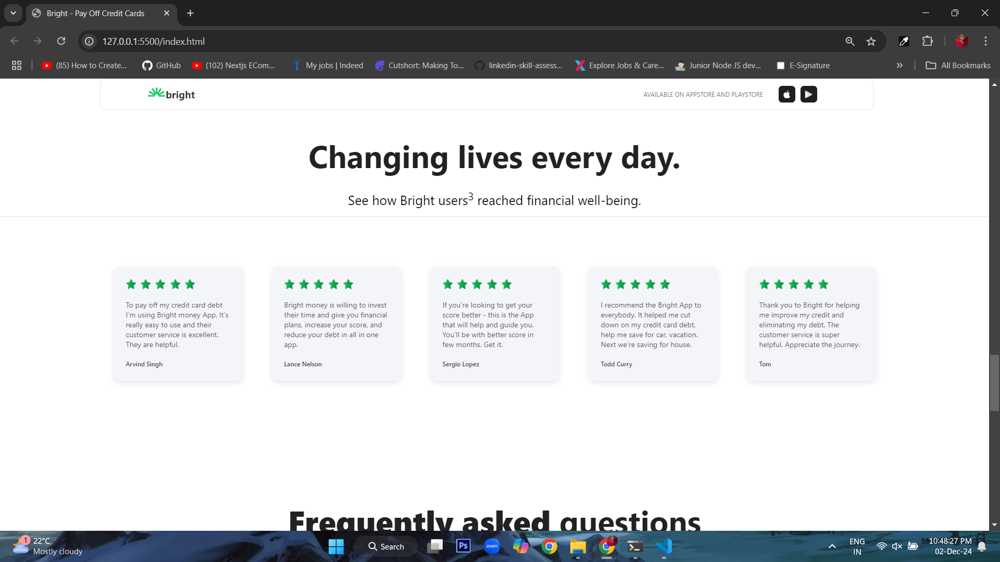
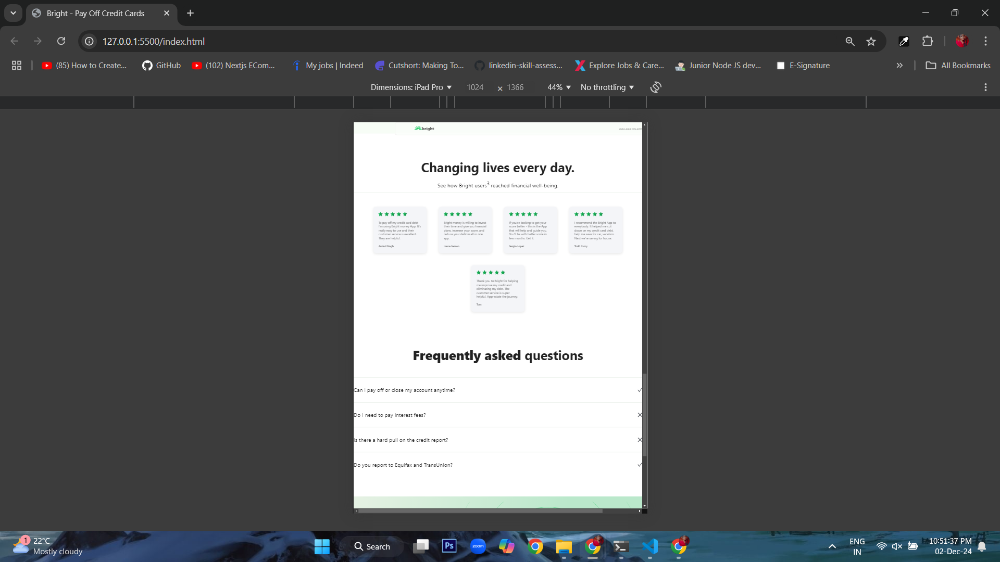
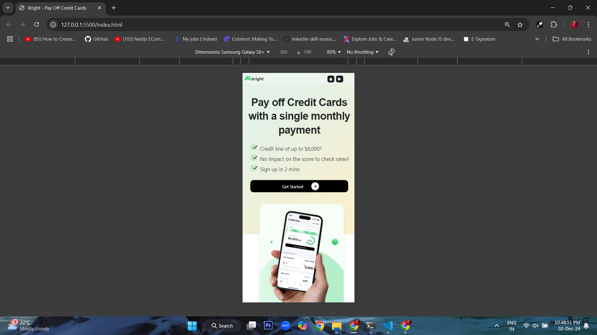

# Assignment 

This repository contains the deliverables for the **Web Developer Role Assignment**, showcasing skills in responsive front-end development, SEO optimization, and analytics setup.  

## Features  
1. **Responsive Webpage Design**  
   - Built using HTML, CSS, and JavaScript.  
   - Fully responsive for desktop, tablet, and mobile screens.  

2. **SEO Optimization**  
   - Properly structured HTML with meta tags, alt attributes, and headings.  

3. **Google Tag Manager (GTM)**  
   - Integrated GTM for efficient management of analytics and tracking codes. 

## Screenshots  
Here are the screenshots for desktop, tablet, and mobile views:

- **Desktop View**  
  

- **Tablet View**  
  

- **Mobile View**  
  

## How to Run  
1. Clone the repository:  
   ```bash
   git clone https://github.com/Magdalinprincy/Bright_Money.git
   cd Bright_Money
